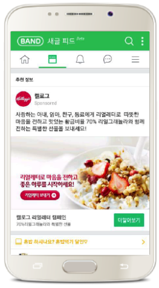
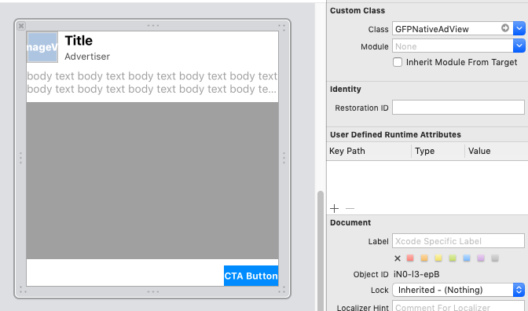
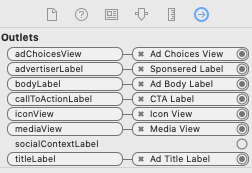

## 네이티브 광고
네이티브 광고를 사용하면 앱의 컨텐츠와 유사한 형태의 광고 유닛을 디자인할 수 있습니다.



## 네이티브 일반형 가이드

### GFPSDK Import
GFPSDK 모듈을 import 합니다.

<details open><summary>Example-swift</summary>   
<p>

```swift
import GFPSDK
```
</p>
</details>

<details open><summary>Example-ObjC</summary>   
<p>

```objective-c
@import GFPSDK;
```
</p>
</details>

### 네이티브 광고 제공자 초기화
연동할 네이티브 광고 제공자의 Pod이 프로젝트에 추가된 상태에서 GFPAdManager를 통해 초기화 합니다. (앱이 구동되는 시점에 한번만 수행)

|Provider| Option Ad Provider|
|--- | --- |
|GFPNativeProviderOptionNDA|네이버 GFP 네이티브 광고|
|GFPNativeProviderOptionDFP|구글 DFP 네이티브 광고|
|GFPNativeProviderOptionFAN|페이스북 FAN 네이티브 광고|
|GFPNativeProviderOptionInMobi|인모비 네이티브 광고|

<details open><summary>Example-swift</summary>   
<p>

```swift
// DFP, NDA, Inmobi, Facebook 배너 광고를 연동하려는 경우 cocoapods 의존성 추가.
GFPAdManager.setup(withPublisherCd: "publisherCd") { (error : GFPError?) in
    print("Setup Eror: \(String(describing: error?.description))")
}
```
</p>
</details>

<details open><summary>Example-ObjC</summary>   
<p>

```objective-c
// DFP, NDA, Inmobi, Facebook 배너 광고를 연동하려는 경우 cocoapods 의존성 추가.
[GFPAdManager setupWithPublisherCd:@"publisherCd" completionHandler:^(GFPError * _Nullable error) {
    NSLog(@"Setup ERROR: %@", error);
}];
```
</p>
</details>

### 뷰 컨트롤러 작성
뷰 컨트롤러(MyViewController)를 만들고, 헤더파일(MyViewController.h)에 아래 작업을 수행합니다.  
 (이 예제에서는 하나의 뷰 컨트롤러가 모든 이벤트 프로토콜을 구현합니다.)

1. 뷰 컨트롤러에 GFPAdLoader *adLoader 프로퍼티를 선언합니다.
2. 뷰 컨트롤러에 GFPAdLoaderDelegate 프로토콜을 구현합니다.
3. 뷰 컨트롤러에 GFPNativeAd *nativeAd 프로퍼티를 선언합니다.
4. 뷰 컨트롤러에 GFPNativeAdDelegate 프로토콜을 구현합니다.

> GFPAdLoaderDelegate는 네이티브 (및 배너) 광고 로드 관련 이벤트를, GFPNativeAdDelegate 로드된 네이티브 객체의 노출, 클릭, 렌더링 에러등의 이벤트를 전달합니다.


<details open><summary>Example-swift</summary>   
<p>

```swift
// MyViewController.h
import GFPSDK

class MyViewController : UIViewController, GFPAdLoaderDelegate, GFPNativeAdDelegate {
    private var adLoader : GFPAdLoader?

    private var nativeAd : GFPNativeAd?
    private var nativeAdView : GFPNativeAdView?
}
```
</p>
</details>

<details open><summary>Example-ObjC</summary>   
<p>

```objective-c
// MyViewController.h

@import GFPSDK;

@interface MyViewController : UIViewController <GFPAdLoaderDelegate, GFPNativeAdDelegate>

@property (nonatomic) GFPAdLoader *adLoader;

@property (nonatomic) GFPNativeAd *nativeAd;
@property (nonatomic) GFPNativeAdView *nativeAdView;

@end
```
</p>
</details>


### GFPAdLoader 생성 및 광고 요청
MyViewController.m의 viewDidLoad 메소드에서 **GFPAdLoader**의 인스턴스를 생성하고, **광고를 요청**합니다.   

- GFPAdLoader 인스턴스를 생성할 때, 발급받으신 **광고유닛 ID**와 함께, **GFPAdParam** 에서 사용자 정보를 세팅해주세요.  GFPAdParam은 광고 효과를 높이기 위한 타게팅에 사용됩니다.


<details open><summary>Example-swift</summary>   
<p>

```swift
override func viewDidLoad() {
    super.viewDidLoad()
        
    let adParam = GFPAdParam()
    adParam.yearOfBirth = 1990
    adParam.gender = .male
    ...
        
    self.adLoader = GFPAdLoader(unitID: "UnitId", rootViewController: self, adParam: adParam)
        
    let nativeOption = GFPAdNativeOptions()
    nativeOption.renderingSetting = ... // 로드될 네이티브 일반형 광고 렌더링 설정
    self.adLoader?.setNativeDelegate(self, nativeOptions: nativeOption)

    self.adLoader?.delegate = self
    self.adLoader?.loadAd()
}
```
</p>
</details>

<details open><summary>Example-ObjC</summary>   
<p>

```objective-c
- (void)viewDidLoad {
    [super viewDidLoad];

    GFPAdParam *adParam = [[GFPAdParam alloc]init];
    adParam.yearOfBirth = 1990;
    adParam.gender = GFPAdParamGenderTypeMale;
    ...

    self.adLoader = [[GFPAdLoader alloc] initWithUnitID:self.unitID
                                             rootViewController:self
                                                        adParam:adParam];
        
    GFPAdNativeOptions *nativeOptions = [[GFPAdNativeOptions alloc] init];
    nativeOptions.renderingSetting = ...; // 로드될 네이티브 일반형 광고 렌더링 설정
    [self.adLoader setNativeDelegate:self nativeOptions:nativeOptions];
    
    // 광고 요청
    self.adLoader.delegate = self;
    [self.adLoader loadAd];
}
```
</p>
</details>

> 광고 요청 성공 시 GFPAdLoaderDelegate의 `adLoader:didReceiveNativeAd:` 메소드가 호출됩니다.

### 추가 설정 가능 요소들
#### 광고 요청 타임아웃 (기본값 60초)
광고요청 이후 지정한 시간(초)경과 까지 광고 응답을 얻지 못하면 기존 요청이 무효화되며, GFPAdLoaderDelegate의 `adLoader:didFailWithError:responseInfo:` 메소드가 호출됩니다.

<details open><summary>Example-swift</summary>   
<p>

```swift
self.adLoader?.requestTimeoutInterval = ...
```
</p>
</details>

<details open><summary>Example-ObjC</summary>   
<p>

```objective-c
self.adLoader.requestTimeoutInterval = ...
```
</p>
</details>

#### GFPNativeAdRenderingSetting
##### DFP adChoicesView 위치 설정 옵션  
DFP의 adChoiceView는 오버레이 형식으로 렌더링 됩니다. 따라서, adChoicesView가 자동으로 삽입될 네 귀퉁이중 한군데를 비워놓아야 합니다. DFP의 adChoicesView의 기본 위치는 오른쪽 상단 코너이며,  
GFPNativeAdRenderingSetting의 `preferredAdChoicesViewPosition` 을 통해 설정 가능합니다.


<details open><summary>Example-swift</summary>   
<p>

```swift
let renderingSetting = GFPNativeAdRenderingSetting()
renderingSetting.preferredAdChoicesViewPosition = .topRightCorner

let nativeOption = GFPAdNativeOptions()
nativeOption.renderingSetting = renderingSetting
```
</p>
</details>

<details open><summary>Example-ObjC</summary>   
<p>

```objective-c
GFPNativeAdRenderingSetting *setting = [GFPNativeAdRenderingSetting alloc] init];
setting.preferredAdChoicesViewPosition = GFPAdChoicesViewPositionTopRightCorner;

GFPAdNativeOptions *nativeOptions = [[GFPAdNativeOptions alloc] init];
nativeOptions.renderingSetting = setting;
```
</p>
</details>

> 구글 문서에는 adChoiceView를 직접 등록하면 오버레이형식이 아닌 직접 등록한 뷰에 그려진다고 되어있으나, 아직까지 정상 동작 하지 않으므로 우상단이 아닌 위치에 adChoiceView가 렌더링 되기를 원하시는 경우 이 세팅이 필요합니다.

##### 미디어뷰가 없는 네이티브 광고 사용시
미디어뷰가 없는 네이티브 광고(예를들어 아이콘과 타이틀 클릭 버튼만으로 구성된 네이티브 광고)를 사용하려면, GFPNativeAdRenderingSetting 의 `hasMediaView = NO`를 설정해야 합니다. (기본값은 YES)

> 네이티브 뷰에 미디어 뷰 존재여부와 GFPNativeAdRenderingSetting.hasMediaView 상태가 다르면, 네이티브 광고 렌더링 시점에 오류가 발생합니다.


<details open><summary>Example-swift</summary>   
<p>

```swift
let setting = GFPNativeAdRenderingSetting()
setting.hasMediaView = false

let nativeOption = GFPAdNativeOptions()
nativeOption.renderingSetting = setting
```
</p>
</details>

<details open><summary>Example-ObjC</summary>   
<p>

```objective-c
GFPNativeAdRenderingSetting *setting = [GFPNativeAdRenderingSetting alloc] init];
setting.hasMediaView = NO;

GFPAdNativeOptions *nativeOptions = [[GFPAdNativeOptions alloc] init];
nativeOptions.renderingSetting = setting;
```
</p>
</details>

### GFPAdLoaderDelegate

**GFPAdLoaderDelegate**를 구현하시면, 해당 메서드를 통해 광고 로드 관련 이벤트를 받으실 수 있습니다.

#### 로드 성공시
네이티브 광고 로드가 성공하면, GFPNativeAd 객체가 응답값으로 넘어옵니다.  
GFPNativeAd객체를 이용하여 네이티브 광고 뷰(UIView)를 생성하게 됩니다.
GFPNativeAd객체를 이용하여 네이티브 광고 뷰를 구성하는 방법은 [네이티브 광고 뷰 생성](#네이티브-광고-뷰-생성)를 확인해주세요.


<details open><summary>Example-swift</summary>   
<p>

```swift
func adLoader(_ unifiedAdLoader: GFPAdLoader!, didReceive nativeAd: GFPNativeAd!) {
      // nativeAd 객체를 이용하여 광고 뷰 생성
      ...
}
```
</p>
</details>

<details open><summary>Example-ObjC</summary>   
<p>

```objective-c
- (void)adLoader:(GFPAdLoader *)unifiedAdLoader didReceiveNativeAd:(GFPNativeAd *)nativeAd {
      // nativeAd 객체를 이용하여 광고 뷰 생성
      ...
}
```
</p>
</details>

#### 로드 실패시

<details open><summary>Example-swift</summary>   
<p>

```swift
func adLoader(_ unifiedAdLoader: GFPAdLoader!, didFailWithError error: GFPError!, responseInfo: GFPLoadResponseInfo!) {
    ...
}
```
</p>
</details>

<details open><summary>Example-ObjC</summary>   
<p>

```objective-c
- (void)adLoader:(GFPAdLoader *)unifiedAdLoader didFailWithError:(GFPError *)error responseInfo:(GFPLoadResponseInfo *)responseInfo {
    ...
}
```
</p>
</details>

### 네이티브 광고 렌더링
GFPNativeAd가 성공적으로 로드되면, 네이티브 광고를 렌더링할 수 있습니다.  
이를 위해서는 네이티브 광고의 요소가 정의된 뷰 객체가 필요하며, 이 객체는 GFPNativeAdView 클래스를 상속해야 합니다.
이 문서에서는 인터페이스 빌더를 사용하여 뷰를 구성합니다.

#### 네이티브 광고 뷰 생성
1. 네이티브 광고용 뷰(xib)를 만들고, Xcode 의 Identity Inspector 탭에서 Custom Class를 **GFPNativeAdView** 로 설정합니다.
     

2. 네이티브 광고 뷰를 구성하는 각 에셋 뷰(title, body  등등)를 만들고, Connections Inspector 탭에서 GFPNativeAdView의 해당 Outlet과 연결합니다.
  - 광고의 동영상 또는 이미지를 표시하는 데 사용되는 mediaView도 Custom Class를 **GFPMedaiView**로 설정해주어야 합니다.
    

3. 네이티브 광고 로드이후 아래와 같은 형태로 구현이 가능합니다.


<details open><summary>Example-swift</summary>   
<p>

```swift
func adLoader(_ unifiedAdLoader: GFPAdLoader!, didReceive nativeAd: GFPNativeAd!) { 

    // 네이티브 광고객체 및 delegate 등록   
    self.nativeAd = nativeAd
    self.nativeAd?.delegate = self

    // 네이티브 광고 에셋 설정            
    self.nativeAdView?.titleLabel?.text = nativeAd.title
    self.nativeAdView?.bodyLabel?.text = nativeAd.body
    self.nativeAdView?.advertiserLabel?.text = nativeAd.advertiser
    self.nativeAdView?.callToActionLabel?.text = nativeAd.callToAction
    ...

    // 뷰 객체에 네이티브 광고를 세팅하면, iconView, mediaView 렌더링 및 뷰 트래킹이 시작됨.
    self.nativeAdView?.nativeAd = nativeAd

    // subview 등록
    self.view.addSubview(self.nativeAdView!)
}
```
</p>
</details>

<details open><summary>Example-ObjC</summary>   
<p>

```objective-c
// selt.nativeAdView 는 GFPNativeAdView 객체임

- (void)adLoader:(GFPAdLoader *)unifiedAdLoader didReceiveNativeAd:(GFPNativeAd *)nativeAd {

    // 네이티브 광고객체 및 delegate 등록
    self.nativeAd = nativeAd;
    self.nativeAd.delegate = self;
    
    // 네이티브 광고 에셋 설정
    self.nativeAdView.titleLabel.text = nativeAd.title;
    self.nativeAdView.bodyLabel.text = nativeAd.body;
    self.nativeAdView.advertiserLabel.text = nativeAd.advertiser;
    selt.nativeAdView.callToActionLabel.text = nativeAd.callToAction;
    ...
    
    // 뷰 객체에 네이티브 광고를 세팅하면, iconView, mediaView 렌더링 및 뷰 트래킹이 시작됨. 
    self.nativeAdView.nativeAd = nativeAd;
    
    // subview 등록
    [self.view addSubView:self.nativeAdView]
}
```
</p>
</details>

### GFPNativeAdDelegate
네이티브 광고가 노출, 클릭 되었을때 이벤트가 전달 됩니다.

#### 광고 노출 이벤트 발생시


<details open><summary>Example-swift</summary>   
<p>

```swift
func nativeAdWasSeen(_ nativeAd: GFPNativeAd) {
    ...
}
```
</p>
</details>

<details open><summary>Example-ObjC</summary>   
<p>

```objective-c
- (void)nativeAdWasSeen:(GFPNativeAd *)nativeAd {
    ...
}
```
</p>
</details>

#### 클릭 이벤트 발생시

<details open><summary>Example-swift</summary>   
<p>

```swift
func nativeAdWasClicked(_ nativeAd: GFPNativeAd) {
    ...
}
```
</p>
</details>

<details open><summary>Example-ObjC</summary>   
<p>

```objective-c
- (void)nativeAdWasClicked:(GFPNativeAd *)nativeAd {
    ...
}
```
</p>
</details>

#### 렌더링 에러 발생시

<details open><summary>Example-swift</summary>   
<p>

```swift
func nativeAd(_ nativeAd: GFPNativeAd, didFailWithError error: GFPError) {
    ...
}
```
</p>
</details>

<details open><summary>Example-ObjC</summary>   
<p>

```objective-c
- (void)nativeAd:(GFPNativeAd *)nativeAd didFailWithError:(GFPError *)error {
    ...
}
```
</p>
</details>

## 기타
### 직접 광고 제공자의 네이티브 광고 객체를 사용하여  네이티브 광고 렌더링

GFPNativeAd 객체는 네이티브 광고 제공자로부터 얻은 원본 네이티브 객체를 가지고 있으며, GFPNativeAd 객체의 **adProviderNativeAd** 필드를 통해 접근이 가능합니다.  

또한, GFPNativeAd 객체의 **adProviderType**에 따라 현재 로드된 네이티브 광고가 어떤 광고 제공자의 것인지 알 수 있습니다. 따라서 adProviderType에 따라 adProviderNativeAd 객체를 해당 광고 제공자의 네이티브 객체로 업 캐스팅하면, 각 광고 제공자의 원본 네이티브 객체에 접근이 가능합니다.  

최종적으로 이 원본 네이티브 객체를 가지고 각 광고 제공자의 가이드에 따라 네이티브 광고 뷰를 구성하게 됩니다.


<details open><summary>Example-swift</summary>   
<p>

```swift
import FBAudienceNetwork    // FAN SDK
import GoogleMobileAds      // DFP SDK

func adLoader(_ unifiedAdLoader: GFPAdLoader!, didReceive nativeAd: GFPNativeAd!) {

    // 네이티브 광고객체 및 delegate 등록   
    self.nativeAd = nativeAd
    self.nativeAd?.delegate = self

    if nativeAd.adProviderType == .FAN {
        // FAN 네이티브 인 경우
        ...            
    } else if nativeAd.adProviderType == .DFP {
        // DFP 네이티브 인 경우
        ...
    }
}
```
</p>
</details>

<details open><summary>Example-ObjC</summary>   
<p>

```objective-c
@import FBAudienceNetwork;    // FAN SDK
@import GoogleMobileAds;      // DFP SDK

- (void)adLoader:(GFPAdLoader *)unifiedAdLoader didReceiveNativeAd:(GFPNativeAd *)nativeAd {

    // 네이티브 광고객체 및 delegate 등록
    self.nativeAd = nativeAd;
    self.nativeAd.delegate = self;

    if (_nativeAd.adProviderType == GFPNativeAdProviderTypeFAN) {
        // FAN 네이티브 인 경우
        ...


    } else if (gfpNativeAd.adProviderType == GFPNativeAdProviderTypeDFP) {
        // DFP 네이티브 인 경우
        ...
    }

}
```
</p>
</details>

#### 광고제공자별 네이티브 광고 제작 가이드
- [페이스북 FAN 가이드](https://developers.facebook.com/docs/audience-network/ios-native)
- [구글 DFP  가이드](https://developers.google.com/ad-manager/mobile-ads-sdk/ios/native/advanced)
- [인모비 InMobi  가이드](https://support.inmobi.com/monetize/ios-guidelines/native-ads/)


