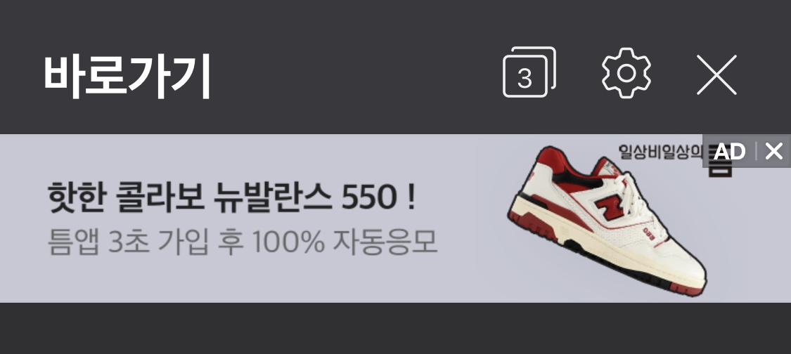
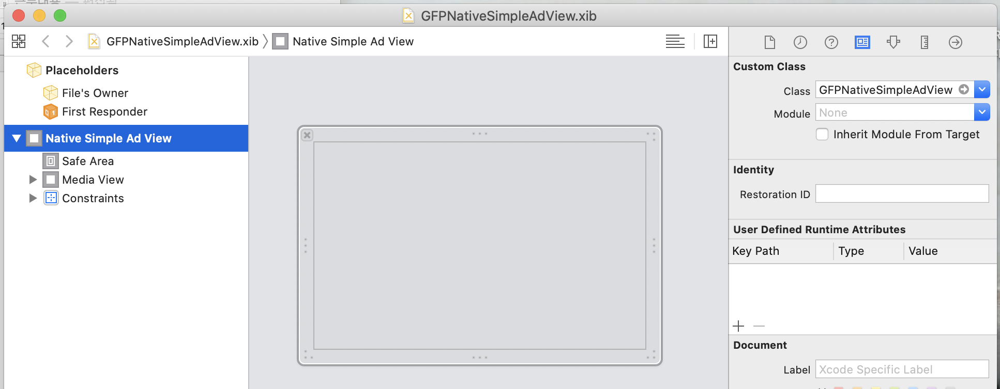
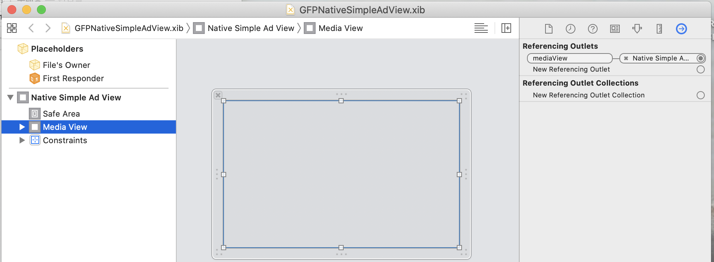
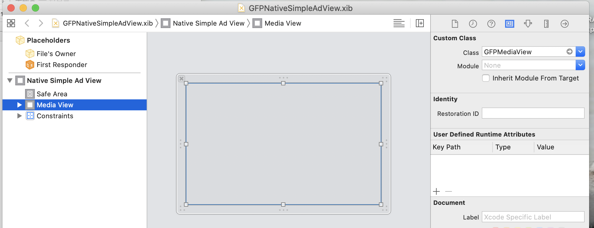

## 네이티브 심플 광고
네이티브 심플 이미지형 광고는 이미지가 단독으로 존재하는 네이티브 형 광고입니다.


## 네이티브 심플 가이드
 Import
GFPSDK 모듈을 import 합니다.

<details open><summary>Example-swift</summary>   
<p>

```swift
import GFPSDK
```
</p>
</details>

<details open><summary>Example-ObjC</summary>   
<p>

```objective-c
@import GFPSDK;
```
</p>
</details>

### 네이티브 광고 제공자 초기화
연동할 네이티브 광고 제공자의 Pod이 프로젝트에 추가된 상태에서 GFPAdManager를 통해 초기화 합니다. (앱이 구동되는 시점에 한번만 수행)

|Provider| Option Ad Provider|
|--- | --- |
|GFPNativeProviderOptionNDA|네이버 GFP 네이티브 광고|
|GFPNativeProviderOptionDFP|구글 DFP 네이티브 광고|
|GFPNativeProviderOptionFAN|페이스북 FAN 네이티브 광고|
|GFPNativeProviderOptionInMobi|인모비 네이티브 광고|

<details open><summary>Example-swift</summary>   
<p>

```swift
// DFP, NDA, Inmobi, Facebook 배너 광고를 연동하려는 경우 cocoapods 의존성 추가.
GFPAdManager.setup(withPublisherCd: "publisherCd") { (error : GFPError?) in
    print("Setup Eror: \(String(describing: error?.description))")
}
```
</p>
</details>

<details open><summary>Example-ObjC</summary>   
<p>

```objective-c
// DFP, NDA, Inmobi, Facebook 배너 광고를 연동하려는 경우 cocoapods 의존성 추가.
[GFPAdManager setupWithPublisherCd:@"publisherCd" completionHandler:^(GFPError * _Nullable error) {
    NSLog(@"Setup ERROR: %@", error);
}];
```
</p>
</details>

## 뷰 컨트롤러 작성
뷰 컨트롤러(MyViewController)를 만들고, 헤더파일(MyViewController.h)에 아래 작업을 수행합니다.  
 (이 예제에서는 하나의 뷰 컨트롤러가 모든 이벤트 프로토콜을 구현합니다.)

1. 뷰 컨트롤러에 GFPAdLoader *adLoader 프로퍼티를 선언합니다.
2. 뷰 컨트롤러에 GFPAdLoaderDelegate 프로토콜을 구현합니다.
3. 뷰 컨트롤러에 GFPNativeSimpleAd *nativeSimpleAd 프로퍼티를 선언합니다.
4. 뷰 컨트롤러에 GFPNativeSimpleAdDelegate 프로토콜을 구현합니다.

> GFPAdLoaderDelegate는 네이티브 (및 배너) 광고 로드 관련 이벤트를, GFPNativeSimpleAdDelegate 로드된 네이티브 객체의 노출, 클릭, 렌더링 에러등의 이벤트를 전달합니다.


<details open><summary>Example-swift</summary>   
<p>

```swift
// MyViewController.h
import GFPSDK

class MyViewController : UIViewController, GFPAdLoaderDelegate, GFPNativeSimpleAdDelegate {
    private var adLoader : GFPAdLoader?

    private var nativeSimpleAd : GFPNativeSimpleAd?
    private var nativeSimpleAdView : GFPNativeSimpleAdView?
}
```
</p>
</details>

<details open><summary>Example-ObjC</summary>   
<p>

```objective-c
// MyViewController.h

@import GFPSDK;

@interface MyViewController : UIViewController <GFPAdLoaderDelegate, GFPNativeSimpleAdDelegate>

@property (nonatomic) GFPAdLoader *adLoader;

@property (nonatomic) GFPNativeSimpleAd *nativeSimpleAd;
@property (nonatomic) GFPNativeSimpleAdView *nativeSimpleAdView;


@end
```
</p>
</details>

## GFPAdLoader 생성 및 광고 요청
MyViewController.m의 viewDidLoad 메소드에서 **GFPAdLoader**의 인스턴스를 생성하고, **광고를 요청**합니다.   

- GFPAdLoader 인스턴스를 생성할 때, 발급받으신 **광고유닛 ID**와 함께, **GFPAdParam** 에서 사용자 정보를 세팅해주세요.  GFPAdParam은 광고 효과를 높이기 위한 타게팅에 사용됩니다.


<details open><summary>Example-swift</summary>   
<p>

```swift
override func viewDidLoad() {
    super.viewDidLoad()
        
    let adParam = GFPAdParam()
    adParam.yearOfBirth = 1990
    adParam.gender = .male
    ...
        
    self.adLoader = GFPAdLoader(unitID: "UnitId", rootViewController: self, adParam: adParam)
        
    let nativeSimpleOption = GFPAdNativeSimpleOptions()
    nativeSimpleOption.renderingSetting = ... // 로드될 네이티브 일반형 광고 렌더링 설정
    self.adLoader?.setNativeSimpleDelegate(self, nativeSimpleOptions: nativeSimpleOption)

    self.adLoader?.delegate = self
    self.adLoader?.loadAd()
}
```
</p>
</details>

<details open><summary>Example-ObjC</summary>   
<p>

```objective-c
- (void)viewDidLoad {
    [super viewDidLoad];

    GFPAdParam *adParam = [[GFPAdParam alloc]init];
    adParam.yearOfBirth = 1990;
    adParam.gender = GFPAdParamGenderTypeMale;
    ...

    self.adLoader = [[GFPAdLoader alloc] initWithUnitID:self.unitID
                                             rootViewController:self
                                                        adParam:adParam];
        
    GFPAdNativeSimpleOptions *nativeSimpleOptions =  [[GFPAdNativeSimpleOptions alloc] init];
    nativeSimpleOptions.simpleAdRenderingSetting = ...; // 로드될 네이티브 이미지형 광고 렌더링 설정
    [self.adLoader setNativeSimpleDelegate:self nativeSimpleOptions:nativeSimpleOptions];
    
    // 광고 요청
    self.adLoader.delegate = self;
    [self.adLoader loadAd];
}
```
</p>
</details>

> 광고 요청 성공 시 GFPAdLoaderDelegate의 `adLoader:didReceiveNativeSimpleAd:` 메소드가 호출됩니다.

### 추가 설정 가능 요소들
#### 광고 요청 타임아웃 (기본값 60초)
광고요청 이후 지정한 시간(초)경과 까지 광고 응답을 얻지 못하면 기존 요청이 무효화되며, GFPAdLoaderDelegate의 `adLoader:didFailWithError:responseInfo:` 메소드가 호출됩니다.

<details open><summary>Example-swift</summary>   
<p>

```swift
self.adLoader?.requestTimeoutInterval = ...
```
</p>
</details>

<details open><summary>Example-ObjC</summary>   
<p>

```objective-c
self.adLoader.requestTimeoutInterval = ...
```
</p>
</details>

#### GFPNativeSimpleAdRenderingSetting
##### 스타일 설정
**GFPAdConfiguration**의 `InterfaceStyle 전역 설정`과 별개로, 특정 화면에서 UI 모드가 다를 때 개별 설정을 통해 아이콘 스타일을 맞출 수 있습니다.
'광고 별 설정 > 전역 설정'의 우선 순위에 따라 적용되며, 광고 별 style 설정이 없을 경우 전역 설정을 따라갑니다.
해당 설정은 NAVER 광고에 한해서만 작동합니다.

<details open><summary>Example-swift</summary>   
<p>

```swift
let simpleRenderingSetting = GFPNativeSimpleAdRenderingSetting()
simpleRenderingSetting.adInterfaceStyle = .light
simpleRenderingSetting.adInterfaceStyle = .dark
simpleRenderingSetting.adInterfaceStyle = .system // 아이폰 설정의 style을 따라갑니다.

let nativeSimpleOption = GFPAdNativeSimpleOptions()
nativeSimpleOption.simpleAdRenderingSetting = simpleRenderingSetting
```
</p>
</details>

<details open><summary>Example-ObjC</summary>   
<p>

```objective-c
GFPNativeAdRenderingSetting *simpleAdRenderingSetting = [[GFPNativeAdRenderingSetting alloc] init];
simpleAdRenderingSetting.adInterfaceStyle = GFPAdInterfaceStyleLight;
simpleAdRenderingSetting.adInterfaceStyle = GFPAdInterfaceStyleDark;
simpleAdRenderingSetting.adInterfaceStyle = GFPAdInterfaceStyleSystem; // 아이폰 설정의 style을 따라갑니다.

GFPAdNativeSimpleOptions *nativeSimpleOptions =  [[GFPAdNativeSimpleOptions alloc] init];    
nativeSimpleOptions.simpleAdRenderingSetting = simpleAdRenderingSetting;
```
</p>
</details>

### GFPAdLoaderDelegate

**GFPAdLoaderDelegate**를 구현하시면, 해당 메서드를 통해 광고 로드 관련 이벤트를 받으실 수 있습니다.

#### 로드 성공시
네이티브 광고 로드가 성공하면, GFPNativeSimpleAd 객체가 응답값으로 넘어옵니다.  
GFPNativeSimpleAd객체를 이용하여 네이티브 광고 뷰(UIView)를 생성하게 됩니다.
GFPNativeSimpleAd객체를 이용하여 네이티브 광고 뷰를 구성하는 방법은 [네이티브 광고 뷰 생성](#네이티브-광고-뷰-생성)를 확인해주세요.

<details open><summary>Example-swift</summary>   
<p>

```swift
func adLoader(_ unifiedAdLoader: GFPAdLoader!, didReceive nativeSimpleAd: GFPNativeSimpleAd!) {
      // nativeSimpleAd 객체를 이용하여 광고 뷰 생성
      ...
}
```
</p>
</details>

<details open><summary>Example-ObjC</summary>   
<p>

```objective-c
- (void)adLoader:(GFPAdLoader *)unifiedAdLoader didReceiveNativeSimpleAd:(GFPNativeSimpleAd *)nativeSimpleAd {
      // nativeSimpleAd 객체를 이용하여 광고 뷰 생성
      ...
}
```
</p>
</details>

#### 로드 실패시


<details open><summary>Example-swift</summary>   
<p>

```swift
func adLoader(_ unifiedAdLoader: GFPAdLoader!, didFailWithError error: GFPError!, responseInfo: GFPLoadResponseInfo!) {
    ...
}
```
</p>
</details>

<details open><summary>Example-ObjC</summary>   
<p>

```objective-c
- (void)adLoader:(GFPAdLoader *)unifiedAdLoader didFailWithError:(GFPError *)error responseInfo:(GFPLoadResponseInfo *)responseInfo {
    ...
}
```
</p>
</details>

## 네이티브 광고 렌더링
GFPNativeSimpleAd가 성공적으로 로드되면, 네이티브 광고를 렌더링할 수 있습니다.  
이를 위해서는 네이티브 광고의 요소가 정의된 뷰 객체가 필요하며, 이 객체는 GFPNativeSimpleAdView 클래스를 상속해야 합니다.
이 문서에서는 인터페이스 빌더를 사용하여 뷰를 구성합니다.

### 네이티브 이미지형 광고 뷰 생성
1. 네이티브 광고용 뷰(xib)를 만들고, Xcode 의 Identity Inspector 탭에서 Custom Class를 **GFPNativeSimpleAdView** 로 설정합니다.
     

2. 네이티브 광고 뷰를 구성하는 각 에셋 뷰(title, body  등등)를 만들고, Connections Inspector 탭에서 GFPNativeSimpleAdView의 해당 Outlet과 연결합니다.
  > GFPNativeSimpleAdView는 GFPNativeBaseView를 상속하며, mediaView의 Outlet은 GFPNativeBaseView.h 에 정의되어 있습니다.
  

  - 광고의 동영상 또는 이미지를 표시하는 데 사용되는 mediaView도 Custom Class를 **GFPMedaiView**로 설정해주어야 합니다.
    

3. 네이티브 광고 로드이후 아래와 같은 형태로 구현이 가능합니다.


<details open><summary>Example-swift</summary>   
<p>

```swift
// selt.nativeSimpleAdView 는 GFPNativeSimpleAdView 객체임

func adLoader(_ unifiedAdLoader: GFPAdLoader!, didReceive nativeSimpleAd: GFPNativeSimpleAd!) {

    // 네이티브 광고객체 및 delegate 등록
    self.nativeSimpleAd = nativeSimpleAd
    self.nativeSimpleAd?.delegate = self

    // 뷰 객체에 네이티브 광고를 세팅하면, mediaView 렌더링 및 뷰 트래킹이 시작됨. 
    self.nativeSimpleAdView?.nativeAd = nativeSimpleAd

    // subview 등록        
    self.view.addSubview(self.nativeSimpleAdView)
}
```
</p>
</details>

<details open><summary>Example-ObjC</summary>   
<p>

```objective-c
// selt.nativeSimpleAdView 는 GFPNativeSimpleAdView 객체임

- (void)adLoader:(GFPAdLoader *)unifiedAdLoader didReceiveNativeSimpleAd:(GFPNativeSimpleAd *)nativeSimpleAd {

    // 네이티브 광고객체 및 delegate 등록
    self.nativeSimpleAd = nativeSimpleAd;
    self.nativeSimpleAd.delegate = self;
    
    // 뷰 객체에 네이티브 광고를 세팅하면, mediaView 렌더링 및 뷰 트래킹이 시작됨. 
    self.nativeSimpleAdView.nativeAd = nativeSimpleAd;
    
    // subview 등록
    [self.view addSubView:self.nativeAdView]
}
```
</p>
</details>

### GFPNativeSimpleAdDelegate
네이티브 광고가 노출, 클릭 되었을때 이벤트가 전달 됩니다.

#### 광고 노출 이벤트 발생시

<details open><summary>Example-swift</summary>   
<p>

```swift
func nativeSimpleAdWasSeen(_ nativeSimpleAd: GFPNativeSimpleAd) {
    ...
}
```
</p>
</details>

<details open><summary>Example-ObjC</summary>   
<p>

```objective-c
- (void)nativeSimpleAdWasSeen:(GFPNativeSimpleAd *)nativeSimpleAd {
    ...
}
```
</p>
</details>

#### 클릭 이벤트 발생시

<details open><summary>Example-swift</summary>   
<p>

```swift
func nativeSimpleAdWasClicked(_ nativeSimpleAd: GFPNativeSimpleAd) {
    ...
}
```
</p>
</details>

<details open><summary>Example-ObjC</summary>   
<p>

```objective-c
- (void)nativeSimpleAdWasClicked:(GFPNativeSimpleAd *)nativeSimpleAd {
    ...
}
```
</p>
</details>

#### 렌더링 에러 발생시


<details open><summary>Example-swift</summary>   
<p>

```swift
func nativeSimpleAd(_ nativeSimpleAd: GFPNativeSimpleAd, didFailWithError error: GFPError) {
    ...
}
```
</p>
</details>

<details open><summary>Example-ObjC</summary>   
<p>

```objective-c
- (void)nativeSimpleAd:(GFPNativeSimpleAd *)nativeSimpleAd didFailWithError:(GFPError *)error {
    ...
}
```
</p>
</details>

#### 광고 미디어 뷰 사이즈 변경
Native Simple의 경우 단일 이미지 광고 이므로, 해당 이벤트 수신 시 Native Simple Ad View의 크기를 변경해주어야 합니다.

> Native Simple Ad View 내의 Media View의 크기는 SDK 내에서 변경합니다.


<details open><summary>Example-swift</summary>   
<p>

```swift
func nativeSimpleAd(_ nativeSimpleAd: GFPNativeSimpleAd, didChangeMediaViewSizeWith size: CGSize) {
    ...
}
```
</p>
</details>

<details open><summary>Example-ObjC</summary>   
<p>

```objective-c
- (void)nativeSimpleAd:(GFPNativeSimpleAd *)nativeSimpleAd didChangeMediaViewSizeWith:(CGSize)size {
    ...
}
```
</p>
</details>

#### 광고가 사용자에 의해 Mute 되었을 때
광고가 Mute 되었을 때, 서비스에 콜백을 통해 Mute 를 알립니다. 
Mute 후 GFPSDK에서는 "이 광고는 더 이상 보이지 않습니다." 라는 화면을 노출하고 있으며, **서비스의 정책**에 따라 광고를 화면에서 없앨 지/그대로 노출할 지를 정합니다.


<details open><summary>Example-swift</summary>   
<p>

```swift
func nativeSimpleAdWasMuted(_ nativeSimpleAd: GFPNativeSimpleAd) {
    
}
```
</p>
</details>

<details open><summary>Example-ObjC</summary>   
<p>

```objective-c
- (void)nativeSimpleAdWasMuted:(GFPNativeSimpleAd *)nativeSimpleAd {

}
```
</p>
</details>
