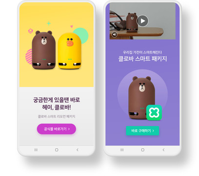

## 보상형 광고
보상형 광고는 전체 화면을 사용하는 동영상 광고입니다. 
현재는 C2S만 지원하고 있으며, 추후에 S2S가 추가될 예정입니다.



## 보상형 가이드

### GFPSDK Import
GFPSDK 모듈을 import 합니다.

<details open><summary>Example-swift</summary>   
<p>

```swift
import GFPSDK
```
</p>
</details>

<details open><summary>Example-ObjC</summary>   
<p>

```objective-c
@import GFPSDK;
```
</p>
</details>


## C2S 보상형 광고 제공자 초기화
연동할 보상형 광고 제공자의 Pod이 프로젝트에 추가된 상태에서 GFPAdManager를 통해 초기화 합니다. (앱이 구동되는 시점에 한번만 수행)

- GFPRewardedAdProviderOptionDFP : 구글 DFP 보상형 광고
- GFPRewardedAdProviderOptionFAN : 페이스북 FAN 보상형 광고


<details open><summary>Example-swift</summary>   
<p>

```swift
// DFP, Facebook 보상형 광고를 연동하려는 경우 cocoapods 의존성 추가.
GFPAdManager.setup(withPublisherCd: "publisherCd") { (error : GFPError?) in
    print("Setup Eror: \(String(describing: error?.description))")
}
```
</p>
</details>

<details open><summary>Example-ObjC</summary>   
<p>

```objective-c
// DFP, Facebook 보상형 광고를 연동하려는 경우 cocoapods 의존성 추가.
[GFPAdManager setupWithPublisherCd:@"publisherCd" completionHandler:^(GFPError * _Nullable error) {
    NSLog(@"Setup ERROR: %@", error);
}];
```
</p>
</details>

## 뷰 컨트롤러 작성
뷰 컨트롤러(MyViewController)를 만들고, 헤더파일(MyViewController.h)에 아래 작업을 수행합니다.  
 (이 예제에서는 뷰 컨트롤러가 매니저를 소유하는 형식으로 구현합니다.)

1. 뷰 컨트롤러에 **GFPRewardedAdManager *adManager 프로퍼티**를 선언합니다.
2. 뷰 컨트롤러에 **GFPRewardedAdManagerDelegate 프로토콜**을 구현합니다.

> **GFPRewardedAdManagerDelegate** 는 보상형 광고의 로드, 실패 여부 및 클릭 여부를 전달합니다.


<details open><summary>Example-swift</summary>   
<p>

```swift
// MyViewController.h
import GFPSDK

class MyViewController : UIViewController, GFPRewardedAdManagerDelegate {
    private var adManager : GFPReweardedAdManager?
}
```
</p>
</details>

<details open><summary>Example-ObjC</summary>   
<p>

```objective-c
// MyViewController.h

@import GFPSDK;

@interface MyViewController : UIViewController <GFPRewardedAdManagerDelegate>

@property (nonatomic) GFPRewardedAdManager *adManager;

@end
```
</p>
</details>


## GFPReweardedAdManager 사용 가이드
### GFPReweardedAdManager 생성 및 광고 로드 요청
MyViewController.m의 viewDidLoad 메소드에서 **GFPReweardedAdManager**의 인스턴스를 생성하고, **광고를 요청**합니다.   
- 인스턴스를 생성 후에는 **delegate**를 잊지말고 설정해줍니다.
- GFPReweardedAdManager 인스턴스를 생성할 때, 발급받으신 **광고유닛 ID**와 함께, **GFPAdParam** 에서 사용자 정보를 세팅해주세요.  GFPAdParam은 광고 효과를 높이기 위한 타게팅에 사용됩니다.


<details open><summary>Example-swift</summary>   
<p>

```swift
override func viewDidLoad() {
    super.viewDidLoad()
        
    let adParam = GFPAdParam()
    adParam.yearOfBirth = 1990
    adParam.gender = .male
    ...
    
    //인스턴스 생성    
    self.adManager = GFPRewardedAdManager(unitID: "UnitID", adParam: adParam)
    //Delegate
    self.adManager?.delegate = self
    //Timeout
    self.adManager?.requestTimeoutInterval = 60
    //광고 요청
    self.adManager?.load()
}
```
</p>
</details>

<details open><summary>Example-ObjC</summary>   
<p>

```objective-c
- (void)viewDidLoad {
    [super viewDidLoad];

    GFPAdParam *adParam = [[GFPAdParam alloc]init];
    adParam.yearOfBirth = 1990;
    adParam.gender = GFPAdParamGenderTypeMale;
    ...

    //인스턴스 생성
    self.adManager = [[GFPRewardedAdManager alloc] initWithUnitID:@"UnitID" adParam:adParam];               
    //Delegate
    self.adManager.delegate = self;
    //Timeout
    self.adManager.requestTimeoutInterval = 60;
    //광고 요청
    [self.adManager load];

}
```
</p>
</details>


> 매니저는 한개의 광고를 로드하면 사용성이 다하도록 설계되었습니다. 새로운 광고를 로드할 때는 새로운 매니저를 다시 만들어주세요.

> 광고 요청 성공 시 GFPRewardedAdManagerDelegate `rewardedAdManager:didLoadAd:` 메소드가 호출됩니다.


### 추가 설정 가능 요소들
#### 광고 요청 타임아웃 (기본값 60초) [개별 로더 설정]
광고요청 이후 지정한 시간(초)경과 까지 광고 응답을 얻지 못하면 기존 요청이 무효화되며, GFPRewardedAdManagerDelegate `rewardedAdManager:didFailWithError:responseInfo:` 메소드가 호출됩니다.
로더별로 다르게 설정하고 싶을 때 사용합니다.


<details open><summary>Example-swift</summary>   
<p>

```swift
self.adManager?.requestTimeoutInterval = ...
```
</p>
</details>

<details open><summary>Example-ObjC</summary>   
<p>

```objective-c
self.adManager.requestTimeoutInterval = ...
```
</p>
</details>


#### 광고 요청 타임아웃 (기본값 60초) [SDK 전체 설정]
광고요청 이후 지정한 시간(초)경과 까지 광고 응답을 얻지 못하면 기존 요청이 무효화되며, GFPRewardedAdManagerDelegate `rewardedAdManager:didFailWithError:responseInfo:` 메소드가 호출됩니다.
로더 생성 시에 기본으로 세팅되는 기본값을 바꾸고 싶을 때 사용합니다.


<details open><summary>Example-swift</summary>   
<p>

```swift
GFPAdManager.adConfiguration().rewardedAdRequestTimeout = ...
```
</p>
</details>

<details open><summary>Example-ObjC</summary>   
<p>

```objective-c
[GFPAdManager adConfiguration].rewardedAdRequestTimeout = ...
```
</p>
</details>

### 광고 노출 요청
GFPRewardedAdManagerDelegate `rewardedAdManager:didLoadAd:` 로 성공 응답을 받았다면, 
`show:(UIViewController *)` 메서드로 광고 노출을 요청할 수 있습니다.


<details open><summary>Example-swift</summary>   
<p>

```swift
self.adManager?.show(self)
```
</p>
</details>

<details open><summary>Example-ObjC</summary>   
<p>

```objective-c
[self.adManager show:self];
```
</p>
</details>


> 광고 노출 요청 시, 노출에 실패한다면 GFPRewardedAdManagerDelegate `rewardedAdManager:didFailWithError:responseInfo:` 메소드가 호출됩니다.
> 광고 로드와 광고 노출이 분리되어 있기 때문에, 로드를 먼저 한 후에 노출을 하는 형식으로 구현할 수 있습니다.
  이 때의 로드된 광고 유효시간은 **DFP, FAN : 60분**입니다.


## GFPRewardedAdManagerDelegate
**GFPRewardedAdManagerDelegate**를 구현하시면, 해당 메서드를 통해서 보상형 광고의 이벤트를 전달받을 수 있습니다.

### 로드 이벤트
#### 로드 성공 시


<details open><summary>Example-swift</summary>   
<p>

```swift
func rewardedAdManager(_ manager: GFPRewardedAdManager, didLoad rewardedAd: GFPRewardedAd) {
     ...
}
```
</p>
</details>

<details open><summary>Example-ObjC</summary>   
<p>

```objective-c
- (void)rewardedAdManager:(nonnull GFPRewardedAdManager *)manager didLoadAd:(nonnull GFPRewardedAd *)rewardedAd {
    ...
}
```
</p>
</details>

#### 로드 실패 시

<details open><summary>Example-swift</summary>   
<p>

```swift
 func rewardedAdManager(_ manager: GFPRewardedAdManager, didFailWithError error: GFPError, responseInfo:GFPLoadResponseInfo!) {
    ...   
}
```
</p>
</details>

<details open><summary>Example-ObjC</summary>   
<p>

```objective-c
- (void)rewardedAdManager:(nonnull GFPRewardedAdManager *)manager didFailWithError:(nonnull GFPError *)error responseInfo:(nullable GFPLoadResponseInfo *)responseInfo {
    ...
}
```
</p>
</details>
    
> 로드 실패 뿐만 아니라 화면 노출 실패, 유효기간 만료 등의 실패 사항도 모두 해당 메서드로 전달받을 수 있습니다.

### LifeCycle Event
#### 광고 시청 화면 시작 시


<details open><summary>Example-swift</summary>   
<p>

```swift
func rewardedAdManager(_ manager: GFPRewardedAdManager, didStart rewardedAd: GFPRewardedAd) {
    ...
}
```
</p>
</details>

<details open><summary>Example-ObjC</summary>   
<p>

```objective-c
- (void)rewardedAdManager:(nonnull GFPRewardedAdManager *)manager didStartAd:(nonnull GFPRewardedAd *)rewardedAd {
    ...
}
```
</p>
</details>

#### 광고 시청 완료

<details open><summary>Example-swift</summary>   
<p>

```swift
func rewardedAdManager(_ manager: GFPRewardedAdManager, didComplete rewardedAd: GFPRewardedAd, with reward: GFPReward?) {
    ...
}    
```
</p>
</details>

<details open><summary>Example-ObjC</summary>   
<p>

```objective-c
- (void)rewardedAdManager:(nonnull GFPRewardedAdManager *)manager didCompleteAd:(nonnull GFPRewardedAd *)rewardedAd withReward:(nullable GFPReward *)reward {
    ...
}
```
</p>
</details>

> FAN에서는 보상 정보를 알려주지 않기 때문에, reward 값이 없습니다.

#### 광고 화면 사라질 시

<details open><summary>Example-swift</summary>   
<p>

```swift
func rewardedAdManager(_ manager: GFPRewardedAdManager, didClose rewardedAd: GFPRewardedAd) {
    ...
}    
```
</p>
</details>

<details open><summary>Example-ObjC</summary>   
<p>

```objective-c
- (void)rewardedAdManager:(nonnull GFPRewardedAdManager *)manager didCloseAd:(nonnull GFPRewardedAd *)rewardedAd {
...
}
```
</p>
</details>

#### 광고화면 클릭 시

<details open><summary>Example-swift</summary>   
<p>

```swift
func rewardedAdManager(_ manager: GFPRewardedAdManager, wasClickedAd rewardedAd: GFPRewardedAd) {
    ...
}
```
</p>
</details>

<details open><summary>Example-ObjC</summary>   
<p>

```objective-c
- (void)rewardedAdManager:(nonnull GFPRewardedAdManager *)manager wasClickedAd:(nonnull GFPRewardedAd *)rewardedAd {
    ...
}
```
</p>
</details>

